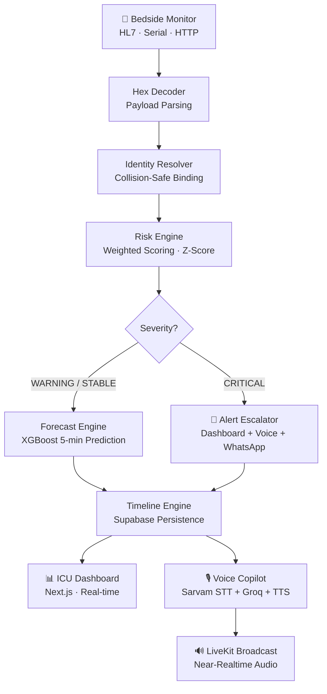

---

# 🏥 Rapid AI — Real-Time ICU Telemetry Intelligence Platform

### AI-Powered ICU Early Warning & Voice Copilot | Team Syntrix

> *"Every second an ICU deterioration goes undetected is a second the system failed the patient. Rapid AI closes that gap — before the emergency happens."*

---

## 1. Problem Statement

India's ICUs are critically understaffed and overmonitored — but under-intelligent.

- **5,000+ bedside monitor alerts fire per shift** — nurses experience alert fatigue and miss real ones
- **Monitor identity collisions** silently assign vitals to the wrong patient record
- **No predictive layer** — systems show *current* vitals, not *next-5-minute* deterioration risk
- **Language barriers** slow handovers between doctors, nurses, and paramedics
- **Late escalation** means critical patients wait while minor cases occupy attention first
- Government ICUs like **KGMU Lucknow** and **Safdarjung Hospital** have zero AI-assisted triage today

---

## 2. Solution Overview

Rapid AI is a **real-time ICU intelligence layer** that sits between bedside monitors and clinical decision-makers.

It ingests raw telemetry → decodes it → resolves patient identity → computes risk → forecasts deterioration → fires smart alerts → and answers voice queries in **14 Indian languages**.

| Capability | What it does |
|---|---|
| 🔴 **Risk Engine** | Weighted multi-signal scoring with z-score + flatline detection |
| 🔮 **Forecast Engine** | XGBoost 5-minute deterioration prediction with confidence score |
| 🔊 **Voice Copilot** | Hindi/English ICU queries answered via Sarvam STT + TTS + Groq |
| 📡 **HL7 Bridge** | Real hospital monitor ingestion via HL7 ORU^R01 + TCP + Serial |
| 🚨 **Alert Escalation** | Dashboard + Voice broadcast + WhatsApp for off-site doctors |
| 🧬 **Identity Resolver** | Collision-safe monitor-patient binding with deterministic fallback |
| 🔢 **Hex Decoder** | Raw hex packet → structured vitals (HR, SpO2, Temp, BP) |
| 📊 **Timeline Intelligence** | Full risk transition + alert + vitals history in Supabase |

---

## 3. Live Demo — 60 Second Script for Judges

```
1. Open dashboard → all services show GREEN
2. POST /telemetry/update with critical vitals → watch risk jump to CRITICAL
3. Observe auto-alert fire with channels: [dashboard, voice, whatsapp]
4. Open Forecast Widget → see "Trend: INCREASING, Confidence: 87%"
5. Submit hex payload → Hex Decoder panel resolves to structured vitals
6. Ask voice query: "Patient 203 ka status kya hai?" → Hindi response spoken
7. Open Patient Detail page → full triage insights + timeline
8. Hit Simulator Toggle → continuous synthetic load, watch timeline evolve
```

---

## 4. Agent / Pipeline Architecture



---

## 5. System Architecture

```mermaid
graph TB
    subgraph Frontend ["🖥️ Frontend — Next.js 16 + TypeScript + Tailwind"]
        UI1[ICU Dashboard]
        UI2[Voice Chat Console]
        UI3[Patient Drilldown Page]
        UI4[API Access Portal]
    end

    subgraph Node ["⚡ Telemetry Backend — Express.js"]
        N1[/telemetry/update]
        N2[/voice/query]
        N3[/icu/summary + timeline]
        N4[/api-key/*]
        N5[Risk Analyzer]
        N6[Alert Dispatcher]
        N7[Escalation Engine]
    end

    subgraph Flask ["🧠 Analytics Backend — Flask + Python"]
        F1[/api/v1/telemetry/ingest]
        F2[/api/v1/forecast/next]
        F3[/api/v1/analysis/triage]
        F4[XGBoost Forecast Model]
        F5[Triage Service]
    end

    subgraph Voice ["🎙️ Voice Intelligence"]
        V1[Sarvam STT\n14 Languages]
        V2[Groq Intent Router]
        V3[Sarvam TTS]
        V4[LiveKit Broadcast]
    end

    subgraph Adapters ["📡 Hardware Adapters"]
        A1[HL7 TCP Listener\nORU^R01 Parser]
        A2[Serial Bridge\nReconnect Logic]
        A3[Simulator Engine\nSafe Demo Mode]
    end

    subgraph DB ["🗄️ Supabase — Persistence Layer"]
        D1[patients]
        D2[telemetry_events]
        D3[alert_events]
        D4[voice_interactions]
        D5[api_keys · usage_logs]
    end

    Frontend --> Node
    Node --> Flask
    Node --> Voice
    Adapters --> Node
    Node --> DB
    Flask --> DB
    Voice --> V4
```

---

## 6. Risk Scoring Engine

Rapid AI computes a **normalized 0–100 risk score** from real-time vitals using three combined signals:

```
RiskScore = range_violation_score + z_score_penalty + flatline_penalty
```

| Signal | Critical Threshold | Mild Threshold |
|---|---|---|
| SpO2 | < 85% | < 90% |
| Heart Rate | < 40 or > 140 bpm | < 60 or > 100 bpm |
| Temperature | < 35°C or > 39°C | < 36°C or > 38°C |
| Blood Pressure (SBP) | < 70 or > 160 mmHg | < 90 or > 140 mmHg |
| MAP | < 55 or > 120 mmHg | < 65 or > 105 mmHg |

**Severity Bands:**

| Score | Level |
|---|---|
| 0–24 | 🟢 STABLE |
| 25–49 | 🟡 WARNING |
| 50–74 | 🟠 MODERATE |
| 75–100 | 🔴 CRITICAL |

> Z-score drift detection and **flatline alert** (zero-variance over 10 readings) are included — catching sensor failure and neurological events that simple thresholds miss.

---

## 7. Forecasting Engine

```
POST /api/v1/forecast/next

Response:
{
  "patientId": "205",
  "predictedRisk": "CRITICAL",
  "confidence": 0.87,
  "trend": "increasing"
}
```

- **Model:** XGBoost classifier trained on physiological vitals (HR, SpO2, Temp, SBP, DBP)
- **Horizon:** 5-minute deterioration window
- **Fallback:** Deterministic heuristic when ML service is unavailable — zero downtime
- **Confidence:** Category-probability from model used to surface uncertainty to clinicians

---

## 8. Voice Copilot — 14 Indian Languages

Rapid AI's voice layer enables hands-free ICU queries in the language staff actually use:

```
Nurse speaks: "Patient 203 ka status kya hai?"
              ↓ Sarvam STT (Hindi detection)
              ↓ Groq intent classification → PATIENT_STATUS
              ↓ Supabase patient lookup → vitals + risk score
              ↓ Sarvam TTS (Hindi response)
              ↓ LiveKit broadcast to ICU room
Doctor hears: "Patient 203 critical hai, SpO2 86%, HR 142..."
```

**Supported Languages:** English, Hindi, Bengali, Tamil, Telugu, Marathi, Gujarati, Kannada, Malayalam, Punjabi, Urdu, Odia, Assamese, Nepali

**Supported Intents:** `PATIENT_STATUS` · `ICU_SUMMARY` · `LANGUAGE_SWITCH` · `PLATFORM_GUIDE` · `GENERAL_QUERY`

---

## 9. Real Hospital Monitor Compatibility

| Integration | Status |
|---|---|
| HL7 ORU^R01 TCP Listener | ✅ Implemented |
| Serial Monitor Bridge (RS-232) | ✅ Implemented with reconnect logic |
| Hex Telemetry Decoder | ✅ Implemented |
| Structured JSON Ingestion | ✅ Implemented |
| FHIR Connector | 🔜 Planned |
| MQTT Bedside IoT | 🔜 Planned |

---

## 10. API Surface

| Endpoint | Method | Description |
|---|---|---|
| `/telemetry/update` | POST | Ingest vitals → risk score → alert |
| `/api/v1/telemetry/ingest` | POST | Analytics decode + normalize |
| `/api/v1/forecast/next` | POST | 5-min deterioration prediction |
| `/api/v1/analysis/triage` | POST | Triage priority + risk explanation |
| `/api/v1/patients` | GET | All active patient states |
| `/api/v1/alerts` | GET | Recent alert history |
| `/icu/summary` | GET | ICU-wide severity distribution |
| `/icu/timeline` | GET | Full telemetry + alert timeline |
| `/voice/query` | POST | Process voice/text clinical query |
| `/voice/token` | GET | LiveKit session token |
| `/api-key/my-key` | GET | Generate/fetch API key |
| `/integration/status` | GET | WhatsApp + LiveKit readiness |

---

## 11. Tech Stack

| Layer | Technology |
|---|---|
| Frontend | Next.js 16, React 19, TypeScript, Tailwind CSS 4 |
| Telemetry Backend | Node.js, Express.js, WebSocket |
| Analytics Backend | Python, Flask, FastAPI-compatible |
| ML Model | XGBoost, scikit-learn, StandardScaler |
| Voice STT/TTS | Sarvam AI (14 Indian languages) |
| LLM / Intent | Groq (LLaMA-based, with heuristic fallback) |
| Realtime | LiveKit WebRTC |
| Database | Supabase (PostgreSQL + RLS) |
| Containerization | Docker, Docker Compose |
| Monitor Adapters | HL7 TCP, SerialPort, Python Simulator |
| Payments (API Tier) | Razorpay |

---

## 12. Quick Start

### Docker (Recommended)

```bash
git clone https://github.com/your-org/RapidAI.git
cd RapidAI/icu_hackathon_backend
cp .env.example .env       # fill in your API keys
docker compose up --build -d
```

### Manual Setup

```bash
# Install dependencies
npm --prefix server install
npm --prefix client install
pip install -r requirements.txt -r requirements-ml.txt

# Apply Supabase schema
supabase link --project-ref <your-ref>
supabase db query --linked -f server/supabase/patient_schema.sql

# Run full stack
npm run start:stack

# Frontend (separate terminal)
npm --prefix client run dev
```

### Environment Variables Required

| Variable | Provider |
|---|---|
| `SUPABASE_URL`, `SUPABASE_SERVICE_ROLE_KEY` | Supabase |
| `LIVEKIT_API_KEY`, `LIVEKIT_SECRET`, `LIVEKIT_WS_URL` | LiveKit |
| `SARVAM_API_KEY` | Sarvam AI |
| `GROQ_API_KEY` | Groq |

---

## 13. Test a Critical Alert (30 seconds)

```bash
curl -X POST http://localhost:4000/telemetry/update \
  -H "Content-Type: application/json" \
  -d '{
    "patientId": "205",
    "heartRate": 142,
    "spo2": 79,
    "temperature": 39.4,
    "bloodPressure": "90/60"
  }'
```

**Expected Response:**
```json
{
  "risk": { "riskScore": 91, "riskLevel": "CRITICAL" },
  "escalationChannels": ["dashboard", "voice", "whatsapp"],
  "forecast": { "predictedRisk": "CRITICAL", "confidence": 0.87, "trend": "increasing" }
}
```

---

## 14. Future Roadmap

- 🏥 Multi-hospital deployment with tenant isolation
- 📋 EHR / ABDM integration for longitudinal patient context
- 🔬 MIMIC-III model training for clinical-grade ML validation
- 📡 MQTT + FHIR native connectors for bedside IoT
- 🧠 Federated learning for cross-site model improvement without raw data sharing

---

## 15. Team

**Team Syntrix** — Building AI infrastructure for underserved healthcare settings in India.

---

## License

MIT © 2025 Team Syntrix
